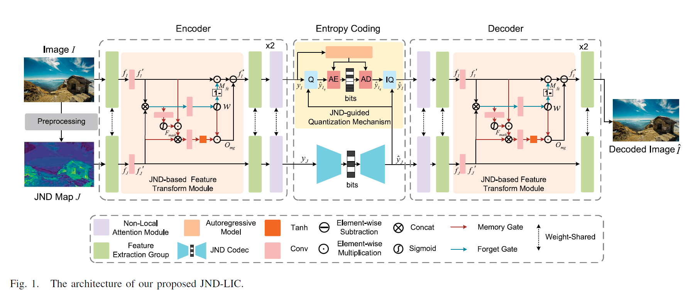

## JND-LIC
Existing human visual perception-oriented image
compression methods well maintain the perceptual quality of
compressed images, but they may introduce fake details into
the compressed images, and cannot dynamically improve the
perceptual rate-distortion performance at the pixel level. To
address these issues, a just noticeable difference (JND)-based
learned image compression (JND-LIC) method is proposed for
human visual perception in this paper, in which a weight-shared
model is used to extract image features and JND features, and the
learned JND features are utilized as perceptual prior knowledge
to assist the image coding process. In order to generate a highly
compact image feature representation, a JND-based feature
transform module is proposed to model the pixel-to-pixel masking
correlation between the image features and the JND features.
Furthermore, inspired by eye movement research that the human
visual system perceives image degradation unevenly, a JND-guided
quantization mechanism is proposed for the entropy coding,
which adjusts the quantization step of each pixel to further
eliminate perceptual redundancies.



## Dataset

The Flicker 2W dataset is used for training, which can be downloaded from this 
[link](https://drive.google.com/file/d/1EK04NO6o3zbcFv5G-vtPDEkPB1dWblEF/view). To get the corresponding JND maps, run the following script:

```bash
python Util.jnd.py
```

## Traing and Testing

```bash
python train.py
python test.py
```

## Requirements
- PyTorch
- Torchvision
- lpips
- numpy
- os
- compressai
- opencv-python


## Citation

If you find our paper or code useful for your research, please cite:

```BibTex
@ARTICLE{10697103,
  author={Pan, Zhaoqing and Zhang, Guoyu and Peng, Bo and Lei, Jianjun and Xie, Haoran and Wang, Fu Lee and Ling, Nam},
  journal={IEEE Transactions on Broadcasting}, 
  title={JND-LIC: Learned Image Compression via Just Noticeable Difference for Human Visual Perception}, 
  year={2024},
  volume={},
  number={},
  pages={1-12},
  doi={10.1109/TBC.2024.3464413}}
```